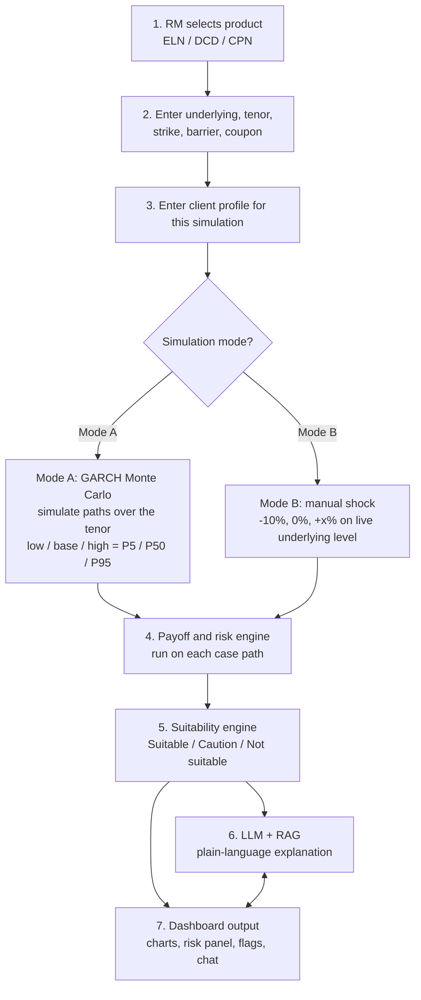
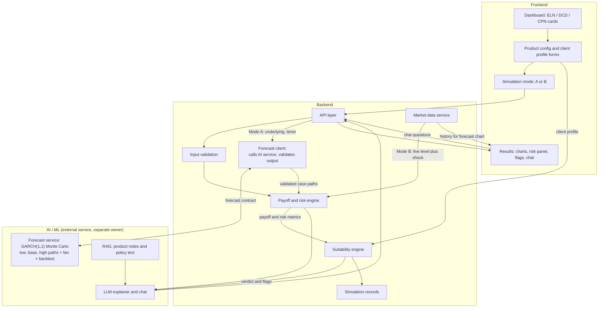

# PRD: Suitability-Aware Payoff Simulator for Structured Products

**Version:** 2.0 (2026-10-03). See §10 for changes from v1.

## 1. Purpose
Help a relationship manager (RM) configure a structured product, see how it pays off under different market conditions, check it against a client's profile, and get a plain-language risk explanation. Goal: reduce mis-selling risk and give a documented suitability check.

## 2. User
The **RM** (shown as "User" in the app) runs the desk. Since 2026-10-07 (approved by Karan, `docs/decisions/2026-10-07-auth-rbac.md`) staff sign in and have one of two roles: **User (RM)** and **Admin** (user management, activity and analytics). The Compliance role was removed on 2026-10-08 at Karan's request. No client login. See §11.

## 3. Products in Scope
| Product | Summary | Key inputs |
|---|---|---|
| **ELN** (reverse convertible) | High coupon, client takes downside on the underlying. Plain or barrier (knock-in) version; European or American barrier. | Underlying, notional, tenor, strike %, barrier %, coupon % p.a., barrier type |
| **DCD** (dual currency deposit) | Short-term deposit with high rate; may be repaid in the alternate currency if it weakens past strike. | Currency pair, deposit amount, tenor, strike rate, enhanced rate |
| **CPN** (capital-protected note) | Protected floor plus partial upside participation. | Underlying, notional, tenor, protection %, participation %, optional cap |

**Tenor** is entered in calendar days. Allowed range: **30 to 1,095 days** (1 month to 3 years) for all products. The Mode A training window is independently configurable from 30 days to 3 years (see §7.3).

## 4. User Flow
1. RM lands on the **dashboard** showing three product cards: ELN, DCD, CPN.
2. RM selects a card and opens the configuration screen.
3. RM enters product terms (see table above), including any tenor in the allowed range.
4. RM enters the **client profile for this simulation**: risk appetite, investment horizon, loss tolerance and concentration (share of portfolio in this product or underlying). No client name or age is asked (changed 2026-10-08 at Karan's request: the RM signs in first, from the home page). Client profiles are not saved or loaded.
5. RM picks a simulation mode:
   - **Mode A:** ML forecast. A statistical model trained on the underlying's historical data simulates many possible price paths over the chosen tenor and returns a **low, base and high case** (5th, 50th and 95th percentile). The product is run on all three cases.
   - **Mode B:** manual shock on the live underlying level (-10%, 0%, +x%).
6. System runs payoff and risk calculation, then the suitability check.
7. RM sees payoff charts, risk panel, suitability verdict, flags, and a plain-language explanation. RM can ask follow-up questions in chat.

## 5. Process Flowchart

## 6. System Architecture

**Reading the diagram:** the frontend collects inputs; the backend validates them, supplies market data, and computes payoff, risk and suitability deterministically; the AI/ML layer is a separate service that forecasts the underlying for Mode A and writes the explanation from the computed results. The backend never trusts AI output without validating it against the forecast contract.

## 7. Functional Requirements

### 7.1 Frontend
- Dashboard with three product cards.
- Product-specific configuration form with validation (for example barrier below strike, tenor between 30 and 1,095 days, positive notional).
- Client profile form for each simulation: risk appetite, investment horizon, loss tolerance and concentration. Client name and age are no longer asked (2026-10-08); the API still accepts them as optional display-only fields. Saved profiles are not supported.
- Simulation mode selector (A or B), a Mode A training-window selector (30 days to 3 years, default 3 years), and a shock input for Mode B (presets and custom %).
- Results view:
  - Payoff-at-maturity chart across a range of underlying levels, with strike, barrier and breakeven marked.
  - Scenario comparison table (for example -25%, -10%, 0%, +15%) showing payoff in currency and %.
  - Mode A: **forecast fan chart** showing recent history, the P5–P95 band, the base (median) line, the low/base/high case paths, and the barrier and strike levels.
  - Mode A: **model card** showing training window (e.g. "Trained on Oct 2023 – Oct 2026"), model name, and backtest results (band coverage and base-case error vs a no-change forecast).
  - Risk panel: payoff and return in the base, low and high cases, and whether the barrier is knocked in in each. In Mode A also show **probability of loss** and, for ELN, **probability of knock-in** across simulated paths.
  - Suitability badge (**Suitable / Caution / Not suitable**) with the specific flags listed.
  - Plain-language explanation panel and chat box.
- Highlight the barrier "cliff" on ELN charts, and the capped gain versus open-ended loss on DCD.
- Show a clear "simulation, not a guarantee" notice. In Mode A, present the result as a range ("Base X, likely range L to H"), never as a single predicted value.
- Compare runs (added 2026-10-08 at Karan's request): the RM can put two or three runs from the session side by side (product, mode, payoff and return, Mode A range and probabilities, verdict and flags). It shows only the backend's results, warns when the runs used different client profiles, modes, shocks or currencies, and does not rank the products or recommend one.
- Open a saved run (added 2026-10-08 at Karan's request): a user can open the full stored record of any of their own saved runs, and an Admin any account's, and print it. It shows what was stored when the run was made (§7.2 record keeping) and recalculates nothing.

### 7.2 Backend
- **Market data service:** fetch and store historical daily closes (underlyings, FX pairs) and the live underlying level (for example Nifty 50). Handle missing data (trading holidays are skipped, not filled) and show data timestamps. Supplies history for the forecast chart and the live level for Mode B.
- **Forecast client (Mode A):** calls the external forecast service with the underlying, tenor and training window; validates the response against the forecast contract (`docs/forecasting.md`); rejects malformed, non-finite, wrong-length or out-of-order output. On failure, Mode A returns a clear error and the RM can switch to Mode B. No fallback forecast is invented.
- **Product configuration:** validate inputs and normalize them for the engine.
- **Payoff and risk engine:** deterministic calculation for each product, taking a forecast path (Mode A) or a single shocked terminal value (Mode B).
  - ELN: `N(1 + cT) - 1_KI · N · max(K - S_T, 0) / K`, with knock-in checked at maturity (European) or on daily closes (American).
  - DCD: `N(1 + cT) · min(1, K / X_T)` in base currency.
  - CPN: `N[p + min(α · max(S_T/S_0 - 1, 0), C)]`, cap optional.
  - **Mode A:** run the formulas on the **low, base and high case paths** (S_T = the path's last value; American knock-in = any daily close on the path breaches the barrier). Output payoff, return and knock-in status for each case.
  - **Mode A distribution metrics:** also run the formula on every sample path returned by the forecast service and report probability of loss, probability of knock-in (ELN), and the P5/P50/P95 of payoff.
- **Suitability engine:** rule-based checks of product risk metrics against the client profile. Verdict: Suitable, Caution, or Not suitable, with reasons. In Mode A the "low case" is the P5 case path. Example rules:
  - Low-case loss above the client's loss tolerance.
  - ELN only: barrier knocked in in the low case (or base case).
  - Tenor longer than investment horizon.
  - Product exposure above the concentration limit.
  - Product risk level above the client's risk appetite (each product type carries a fixed risk rating, for example CPN lower, ELN and DCD higher).
- **Session and record keeping:** store each simulation (inputs, profile, results, verdict, explanation, and in Mode A the forecast metadata: model, training window, as-of date, backtest) so it can be reviewed as evidence of the suitability check. Sample paths are not stored.
- **API layer** exposing: configure, simulate, suitability, explain, chat.

### 7.3 AI / ML

#### Price forecast model (Mode A)
Owned by the AI/ML developer as a separate service. The method below is the agreed approach; the request/response shape is fixed by the forecast contract in `docs/forecasting.md`.

| Aspect | Decision |
|---|---|
| Data | Daily closes of the underlying (Nifty 50: `^NSEI`). |
| Training window | RM-selectable from **30 days to 3 years**, default 3 years. Use the contiguous history in the selected window; do not selectively remove periods within it. The fractional-years range is part of the approved forecast contract. |
| Target | Daily log returns `ln(P_t / P_{t-1})`, never raw prices. |
| Model | GARCH(1,1) with Student-t errors on daily returns. |
| Drift | Historical mean over the training window, or a fixed documented assumption; the choice is returned in the response. |
| Tenor → steps | `tradingDays = round(tenorDays × 252 / 365)`. |
| Simulation | At least 10,000 Monte Carlo paths of `tradingDays` steps starting from the last close. |
| Cases | Low / base / high = the simulated path whose final value is closest to the **5th / 50th / 95th percentile** of final values. |
| Returned extras | Daily P5/P50/P95 fan for the chart; a random sample of full paths (default 500) for distribution metrics. |
| Backtest | Walk-forward over the training window at the requested horizon: coverage of the P5–P95 band (target ≈ 90%), base-case MAPE, and MAPE of a naive no-change forecast for comparison. |
| Optional ML variant | LightGBM quantile regression (α = 0.05, 0.5, 0.95) on lagged returns, realized volatility, moving-average distance and India VIX, with date-based splits only. Shown only if it beats GARCH in the backtest. |

The output is labelled as a scenario, not a guarantee. The model does not compute payoffs, knock-in for a product, or suitability; the backend does.

#### LLM explanation (with RAG)
- Input: product terms, payoff and risk numbers, suitability verdict and flags, client profile, and in Mode A the forecast range and model card.
- Retrieval: product notes (ELN, DCD, CPN descriptions and key risks) and suitability policy text.
- Output: a plain-language summary for a non-expert client covering what the product is, best case, worst case, what triggers a loss, and why it is or is not suitable.
- The LLM **explains only**. All numbers come from the payoff and suitability engines, never generated by the model.

#### Chat
Answers follow-up questions grounded in the current simulation and retrieved product notes; declines or flags questions outside that scope.

#### Guardrails
No promised returns, no advice beyond the computed verdict, risk wording always present, jargon defined simply. Mode A results are always described as a range of scenarios.

## 8. Out of Scope
- Real trading, order placement, or issuer pricing and fair-value calculation.
- Client-facing login, or CRM integration. (Staff accounts and roles are in scope since 2026-10-07, §11.)
- Products beyond ELN, DCD and CPN.
- Tax, fees, and early-redemption pricing (can be noted as future work).
- Tenors above 3 years, intraday data, and point (single-value) price prediction.

## 9. Success Criteria
- RM can go from card selection to a full result in a few minutes; a Mode A forecast returns within 10 seconds for any allowed tenor.
- Payoff outputs match the worked examples in the product notes.
- Every simulation yields a suitability verdict with explicit reasons.
- Explanations are readable by a non-expert and consistent with the computed numbers.
- Both Mode A and Mode B work for all three products.
- Mode A backtest band coverage for Nifty 50 is between 80% and 95% for the 90% band at 3-, 6- and 12-month horizons.

## 10. Changes from v1
- Mode A method fixed: GARCH(1,1) Monte Carlo on log returns, RM-selectable 30-day-to-3-year training window (3-year default), P5/P50/P95 cases.
- Tenor range set to 30–1,095 calendar days and the tenor-to-trading-days rule defined.
- Mode A cases are full daily paths, so American barriers are checked on the path.
- Added Mode A distribution metrics (probability of loss and of knock-in), the fan chart and model card.
- Added the backend forecast client and the forecast contract (`docs/forecasting.md`).
- Success criteria for forecast latency and band coverage added.

## 11. Accounts, roles and sessions (added 2026-10-07)
Approved by Karan on 2026-10-07. Decision record: `docs/decisions/2026-10-07-auth-rbac.md`.
- **Roles and permissions.** User (RM): run simulations, suitability checks, explanations and chat, and see their own saved runs. Admin: everything a user can do, plus see every account's saved runs, the activity log and analytics, create users, change roles and deactivate users. (The Compliance role was removed on 2026-10-08.)
- **Registration and sign-in.** Anyone can register as a user (full name, email id, password); Admin accounts are created by an Admin (the first Admin is seeded from the command line). One sign-in page serves users and admins: the server decides the role and the app opens the simulator for a user and the admin console for an admin. A signed-out visitor starts on the home page and goes to Log in or Create account from there.
- **Saved runs.** Each run is saved to the account that ran it when its verdict is calculated. A user sees only their own runs (Runs window, Saved); an admin sees all of them with the account that ran each. Another account's run id is refused as not found.
- **Admin console (added 2026-10-08).** Overview (accounts, runs, sign-ins, failed sign-ins, runs per day, runs by product, mode and verdict, most active accounts), Activity log (sign-ups, sign-ins and failures, sign-outs, account changes, saved runs), All runs, and Users. The log never stores passwords, tokens or request bodies.
- **Sessions.** A short-lived access token and a rotating refresh token travel in httpOnly cookies. Passwords are stored only as salted hashes.
- **Settings.** Each user has a saved theme (light, dark or system) and a custom-cursor switch.
- **Request integrity.** The web app sends a SHA-256 hash of every request body; the API rejects a body that does not match.
- The role checks live in the backend; the frontend only chooses which screens to show.
